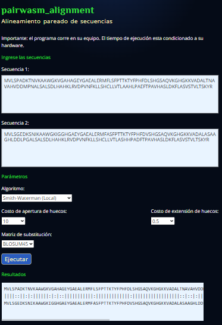

# pairwasm_alignment


WebAssembly performance, portability, and interoperability could bring the power of the Cloud to Bioinformatics and Computational Biology, facilitating collaboration among researchers and enhancing reproducibility.

This experiment is a WebAssembly pairwise sequence alignment module written in Rust 🦀. It implements the classic Needleman-Wunsch and Smith-Waterman.

## Crate documentation and Demonstration

WASM module use is pretty straightforward since it only exposes a single function. You can check the Rust crate [documentation here](https://hdescobarh.github.io/pairwasm_alignment/pairwasm_alignment/).

I also deployed an online demonstration that runs __locally__ and on __your browser__. Be aware that those algorithms uses brute force and have [quadratic performance](https://en.wikipedia.org/wiki/Big_O_notation), __do not__ use the demo for long sequences.

<a href="https://hansescobar.com/en/demo/pairwasm" style="font-size: 1.8rem;"><p style="display:block">Link to the demo<p></a>

## Releases and how to use them

The module is offered in two flavors:

- [npm Module](https://www.npmjs.com/package/pairwasm_alignment)

The wasm module itself is natively an ES module [^1]. It needs a Bundler. Only Webpack offers total compatibility and other bundlers will require additional configurations.

- [Web](https://github.com/hdescobarh/pairwasm_alignment/releases)

It can natively be included on a web page, and doesn't require any further postprocessing [^1].

For example,

```typescript
import init, { do_protein_alignment } from "./wasm_module/pairwasm_alignment.js";

export async function run(
  string_1: string,
  string_2: string,
  open_cost: number,
  extend_cost: number,
  substitution_matrix: number,
  algorithm: number) {
  await init();
  return do_protein_alignment(
    string_1,
    string_2,
    open_cost,
    extend_cost,
    substitution_matrix,
    algorithm
  );
}
```

Then the *run* function can be imported normally in any script.

## Known issues

- Using local alignment can give suboptimal alignments.
</br></br>

--------

[^1]: [Deploying Rust and WebAssembly](https://rustwasm.github.io/docs/wasm-bindgen/reference/deployment.html#deploying-rust-and-webassembly).

## Bibliography

- Chao, J., Tang, F., & Xu, L. (2022). Developments in Algorithms for Sequence Alignment: A Review. Biomolecules, 12(4), 546. <https://doi.org/10.3390/biom12040546>
- Masek, W. J., & Paterson, M. S. (1980). A faster algorithm computing string edit distances. Journal of Computer and System Sciences, 20(1), 18–31. <https://doi.org/10.1016/0022-0000(80)90002-1>
- Needleman, S. B., & Wunsch, C. D. (1970). A general method applicable to the search for similarities in the amino acid sequence of two proteins. Journal of Molecular Biology, 48(3), 443–453. <https://doi.org/10.1016/0022-2836(70)90057-4>
- Smith, T. F., & Waterman, M. S. (1981). Identification of common molecular subsequences. Journal of Molecular Biology, 147(1), 195–197. <https://doi.org/10.1016/0022-2836(81)90087-5>
- Smith, T. F., Waterman, M. S., & Fitch, W. M. (1981). Comparative biosequence metrics. Journal of Molecular Evolution, 18(1), 38–46. <https://doi.org/10.1007/BF01733210>
